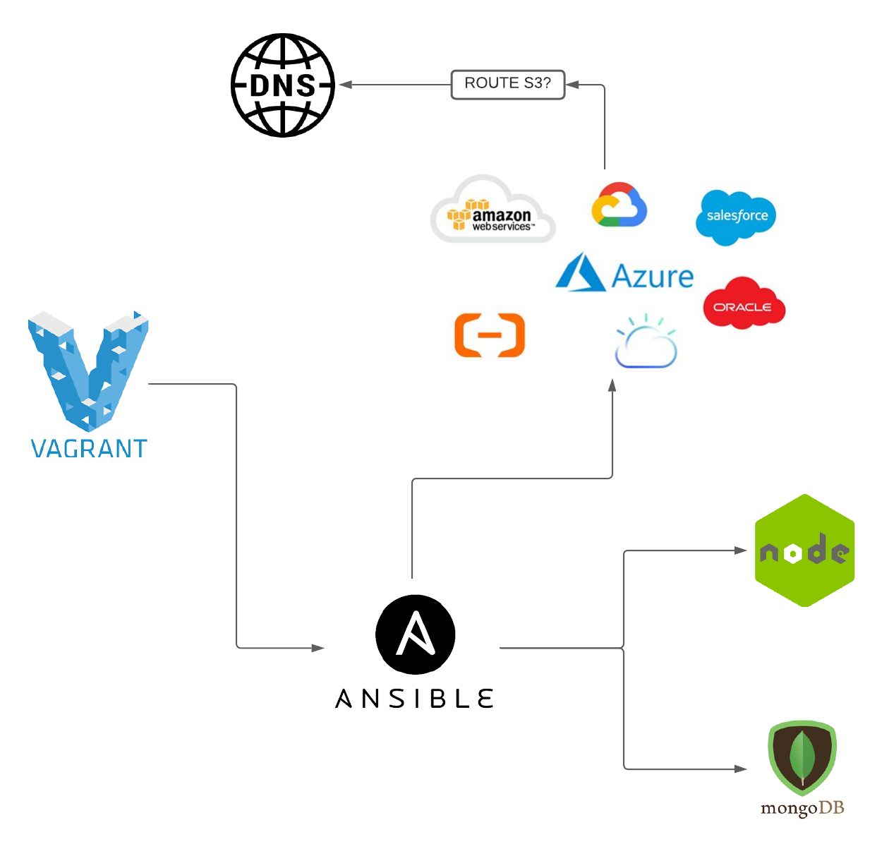

# Ansible controller and agent nodes set up guide
- Clone this repo and run `vagrant up`
- `(double check syntax/intendation)`

## We will use 18.04 ubuntu for ansible controller and agent nodes set up 
### Please ensure to refer back to your vagrant documentation

- **You may need to reinstall plugins or dependencies required depending on the OS you are using.**

```vagrant 
# -*- mode: ruby -*-
# vi: set ft=ruby :

# All Vagrant configuration is done below. The "2" in Vagrant.configure
# configures the configuration version (we support older styles for
# backwards compatibility). Please don't change it unless you know what

# MULTI SERVER/VMs environment 
#
Vagrant.configure("2") do |config|

# creating first VM called web  
  config.vm.define "web" do |web|
    
    web.vm.box = "bento/ubuntu-18.04"
   # downloading ubuntu 18.04 image

    web.vm.hostname = 'web'
    # assigning host name to the VM
    
    web.vm.network :private_network, ip: "192.168.33.10"
    #   assigning private IP
    
    config.hostsupdater.aliases = ["development.web"]
    # creating a link called development.web so we can access web page with this link instread of an IP   
        
  end
  
# creating second VM called db
  config.vm.define "db" do |db|
    
    db.vm.box = "bento/ubuntu-18.04"
    
    db.vm.hostname = 'db'
    
    db.vm.network :private_network, ip: "192.168.33.11"
    
    config.hostsupdater.aliases = ["development.db"]     
  end

 # creating are Ansible controller
  config.vm.define "controller" do |controller|
    
    controller.vm.box = "bento/ubuntu-18.04"
    
    controller.vm.hostname = 'controller'
    
    controller.vm.network :private_network, ip: "192.168.33.12"
    
    config.hostsupdater.aliases = ["development.controller"] 
    
  end

end
```


- To add a machine to the list of hosts you direct to /etc/ansible/hosts start with IP, type of connection, username and password: `192.168.33.10 ansible_connection=ssh ansible_ssh_user=vagrant ansible_ssh_pass=`
- To ping a host you can use `ansible all -m ping` replace `all` with the name of the machines
- To execute `uname` in all of the machines in the hosts file you can do `ansible all -a "uname -a"`
- To check dates in location of all machines `ansible web -a "date"`
- To check memory status `ansible all -a "free"`
- To check uptime of all servers `ansible all -a "uptime"` or `ansible multi -a uptime` 
- To reboot the server `ansible all -m reboot -a reboot_timeout=3600 -u vagrant -i ansible_hosts -b` 
```Sh
Here

-m – represents the module

-a – additional parameter to the reboot module to set the timeout to 3600 seconds

-u – remote SSH user

-i – inventory file

-b – to instruct ansible to become root user before executing the task

Here is the execution output of this ad hoc command. we have three commands in this screenshot, First is to check the status and second to reboot and third one is to check the uptime
```
- to defdine name of hosts `- hosts: web`
- to gather info about host `gather_facts: yes`
- need admin access `become:true`
- in .yml `apt: pkg=nginx` install nginx
```Sh
# This is a playbook to install and set up Nginx in our web server (192.168.33.10)
# This playbook is written in YAML and YAML starts with three dashes (front matter)

---
# name of the hosts - hosts is to define the name of your host of all
- hosts: web

# find the facts about the host
  gather_facts: yes

# admin access
  become: true

# instructions using task module in ansible
  tasks:
  - name: Install Nginx

# install nginx
    apt: pkg=nginx state=present update_cache=yes

# ensure it's running/active
# update cache
# restart nginx if reverse proxy is implemented or if needed
```
- To execute a .yml `ansible-playbook name.yml`
- To check if nginx is running `ansible web -m shell -a "systemctl status nginx"` then connect to IP
- To restart nginx and allow Nginx port 80 and restart do the following:
```Sh
# restart nginx if reverse proxy is implemented or if needed
    notify:
      - restart nginx
  - name: Allow all access to tcp port 80
    ufw:
        rule: allow
        port: '80'
        proto: tcp

  handlers:
    - name: Restart Nginx
      service:
        name: nginx
        state: restarted
```


## Task

```Sh

---

- hosts: web
  gather_facts: yes
  become: true

  tasks:
    - name: "Add nodejs apt key"
      apt_key:
        url: https://deb.nodesource.com/gpgkey/nodesource.gpg.key
        state: present

    - name: "Install nodejs"
      apt:
       update_cache: yes
       name: nodejs
       state: present

```

- What is IAC: No manual handling, run 1 command and everything is done for us
- Playbook are list of tasks that allow us to automate tasks enforces IAC

```Sh
# on the web server we would like to install nodejs with required dependencies so we could launch the nodeapp on the web servers IP

# then moving onto configuring reverse proxy with nginx wso we would launch the app on port 80 instead of 3000

hosts: web
gather_facts: yes

# instruction in this playbook to install nodejs
# tasks: install nodejs

# copy the app code to web server ( you can clone repo from controller to web or os to web)

# go to right location install npm cd app 
# npm start
```
## AWS YML FILE
```YML
# playbook for launchin an aws ec2 instance

---

- hosts: localhost
  connection: local
  gather_facts: True
  become: True
  vars:
    key_name: eng89_devops
    region: eu-west-1
    image: ami-0a6e6cb27b2ee4a95
    id: "eng89_devops playbook to launch an EC2 Instance #2"
    sec_group: "sg-01f0ea5d8295d46c5"
    subnet_id: "subnet-0429d69d55dfad9d2"
    ansible_python_interpreter: /usr/bin/python3
  tasks:

    - name: facts
      block:

      - name: get instance gather_facts
        ec2_instance_facts:
          aws_access_key: "{{aws_access_key}}"
          aws_secret_key: "{{aws_secret_key}}"
          region: "{{ region }}"
        register: result

    - name: provisioning ec2 instances
      block:

      - name: upload public key to aws_access_key
        ec2_key:
          name: "{{ key_name }}"
          key_material: "{{ lookup('file', '~/.ssh/{{ key_name }}.pub') }}"
          region: "{{ region }}"
          aws_access_key: "{{aws_access_key}}"
          aws_secret_key: "{{aws_secret_key}}"

      - name: provision instance
        ec2:
          aws_access_key: "{{aws_access_key}}"
          aws_secret_key: "{{aws_secret_key}}"
          assign_public_ip: True
          key_name: "{{ key_name }}"
          id: "{{ id }}"
          vpc_subnet_id: "{{ subnet_id }}"
          group_id: "{{ sec_group }}"
          image: "{{ image }}"
          instance_type: t2.micro
          region: "{{ region }}"
          wait: True
          count: 1
          instance_tags:
            Name: eng89_mueed_app_ansiblepb

      tags: ['never', 'create_ec2']
```
Ansible dir tree
```Sh
vagrant@controller:/etc/ansible$ tree
.
├── ansible.cfg
├── ec2_instance.yml
├── group_vars
│   └── all
│       └── pass.yml
├── hosts
├── mongodb.yml
├── node2.yml
├── node.yml
└── roles
```
.ssh dir tree
```
vagrant@controller:~/.ssh$ tree
.
├── authorized_keys        
├── eng89_devops
├── eng89_devops.pem       
├── eng89_devops.pub       
└── known_hosts
```
- Move .pem file to .ssh folder in the ansible controller
- Create new SSH keys in .ssh folder using `ssh-keygen -t rsa -b 4096 -f ~/.ssh/{name}` 
- Create a pass.yml in `ansible/group_vars/all/` and enter AWS access and secret key
- to create the instance you need to specify pass and tag `ansible-playbook playbook.yml --ask-vault-pass --tags create_ec2` 